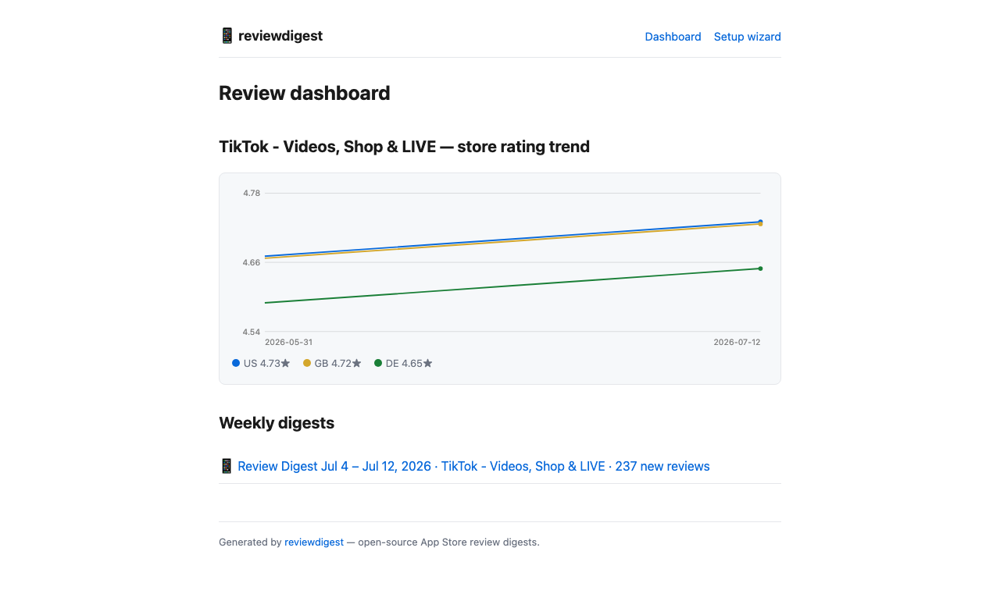
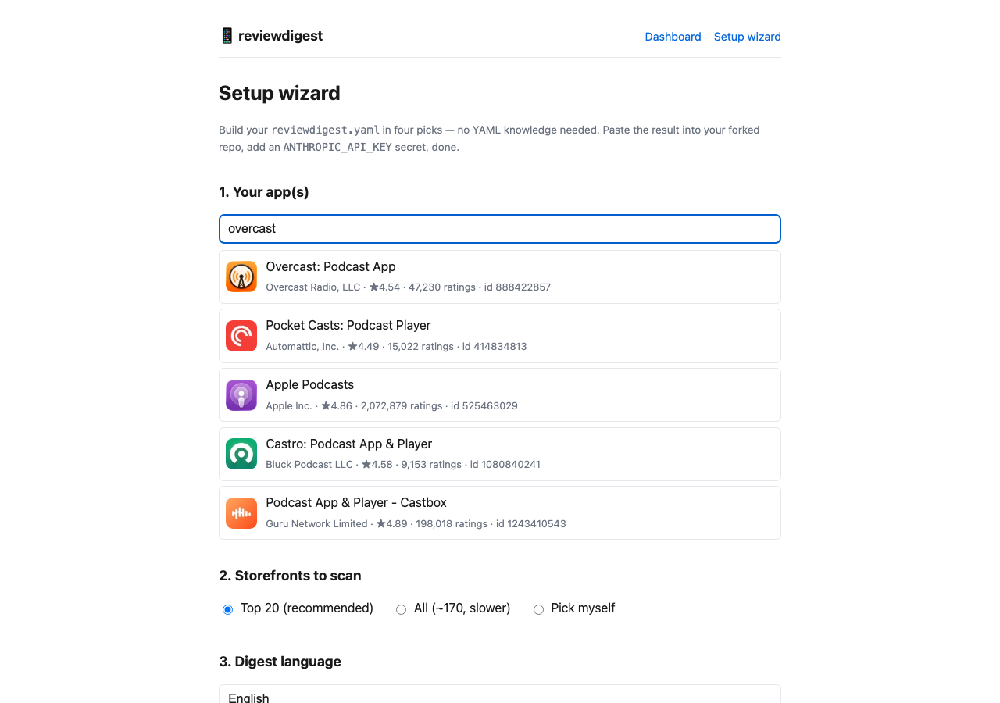

# 📱 reviewdigest

**App Store 评论,AI 替你读。每周一,以 GitHub Issue 送达。**

[English](README.md) | 简体中文

用这个模板建仓库、填上你的 app id、放上你自己的 LLM API key —— 之后每周,AI 自动读取你的 app 在各国 App Store 的最新评论,聚类成**差评主题、崩溃反馈、功能请求、值得回复的评论**,翻译成你的语言,以一份 GitHub Issue 周报送达。

**零服务器、零数据库、零订阅费。** 全部跑在你自己仓库的 GitHub Actions 里,用你自己的 API key。商业工具做同样的事收 ~$199/月;这里唯一的成本是 LLM 调用费(通常每周几美分到 1 美元)。

[](LICENSE)

---

## 周报长什么样

真实产出(对 TikTok 公开评论的一次运行,3 个 storefront 共 237 条新评论):

> **237 条新评论**,来自 3 个 storefront · 平均 2.5★
>
> ### 🚨 差评主题
>
> **无理由封号、警告与年龄限制**(约 30 条,US/GB/DE)—— 自动审核系统封禁自称无违规的用户;申诉流程不透明,机器人式回复反复车轱辘话。
> > "自动审核无缘无故警告我(我只是发了德国国旗),接着直接封号;申诉也被驳回。我没有辱骂、没有霸凌、没有违法。" [DE]
>
> ### 🐛 崩溃与 bug
>
> - **启动黑屏 / 卡 logo 后闪退**(约 20 条,US/GB/DE)—— 最近一次更新后开始,集中在 iPhone 7 / 7 Plus 和 iOS 15.8 / 15.8.8 的 iPad 上……
>
> ### 💬 值得回复
>
> - "更新后启动就黑屏,iPhone 6s iOS 15.8.8……开学要用。" [US ★5] —— *确认旧设备/iOS 15.8.x 崩溃问题;给出修复时间线或临时方案。*

每一节都锚定在真实评论上 —— 计数来自数据、引用必须真实(已翻译,保留来源国标签)、没有内容的小节会如实写 "None this week"。

外加一个**免费仪表盘**(GitHub Pages):各国评分趋势 + 历届周报网页版:



---

## 约 8 分钟拿到第一份周报

你需要:一个 GitHub 账号、一个 App Store 上的 app(自己的或任何公开 app)、一个 LLM API key。

### 1. 复制模板 —— 30 秒

点仓库右上角 **Use this template → Create a new repository**。选 Private 也没问题。你得到的是一份完全属于你的独立副本,不是 fork。

### 2. 填你的 app —— 2 分钟

在你的新仓库里编辑 `reviewdigest.yaml`(github.com 网页上点铅笔图标即可,不用 clone):

```yaml
apps:
  - id: 1234567890        # ← App Store 链接里的那串数字:
                          #   https://apps.apple.com/us/app/<名字>/id1234567890
countries: [us, gb, de, jp]   # 或 `major`(前 20 国)或 `all`(约 170 国)
language: 简体中文             # 周报语言 —— 各国评论引用会翻译成它
```

**不想手写?** 用[配置向导](https://dingdugan.github.io/review.digest/setup.html) —— 搜 app 名字、勾选国家,整份配置文件一键复制:



### 3. 放你自己的 API key —— 2 分钟

在你的仓库:**Settings → Secrets and variables → Actions → New repository secret**

- 名称 `ANTHROPIC_API_KEY`,值填你在 [console.anthropic.com](https://console.anthropic.com) 生成的 key
- 或者 `OPENAI_API_KEY` 并把配置里 `llm.provider` 改为 `openai` —— 任何 OpenAI 兼容端点都可以(`llm.base_url`)

key 加密存在**你的**仓库里,费用走**你的**账户。**没有 key 也能用** —— 周报降级为统计数据 + 按星级分组的原始评论列表,只是没有 AI 分析。

### 4. 跑起来 —— 等 3 分钟

**Actions 标签页 → Review digest → Run workflow。** 几分钟后,第一份周报出现在 **Issues** 里,带 `review-digest` 标签。

### 5.(可选)打开仪表盘 —— 30 秒

**Settings → Pages → Source 选 "GitHub Actions"。** 下次运行起,`https://你的用户名.github.io/仓库名/` 就是你的评分趋势图 + 周报档案馆。跳过这步也完全不影响周报。

### 之后 —— 什么都不用做

每周一 08:00 UTC(改 [.github/workflows/digest.yml](.github/workflows/digest.yml) 里的 cron 可调),新 Issue 自动到。花 5 分钟读完,你就知道这周用户在骂什么、什么崩了、谁值得回复。直接在 Issue 里讨论、关联修复 PR、@ 队友。

---

## 配置参考

所有选项都在 [reviewdigest.yaml](reviewdigest.yaml) 里,带内联注释。要点:

| 配置项 | 默认值 | 说明 |
|---|---|---|
| `apps` | — | 一个或多个 App Store app id;名称自动解析 |
| `countries` | `[us]` | storefront 代码列表,或 `major`(前 20)/ `all`(约 170) |
| `language` | `English` | 周报输出语言;评论引用会被翻译 |
| `lookback_days` | `8` | 每次运行回看的天数(重叠部分自动去重) |
| `llm.provider` | `anthropic` | `anthropic` 或 `openai`(兼容端点走 `base_url`) |
| `llm.model` | `claude-opus-4-8` | 省钱选项:`claude-sonnet-5` |
| `output.type` | `github-issue` | 或 `file` / `stdout` |

## 本地运行

```bash
pip install -r requirements.txt
python -m reviewdigest --dry-run            # 完整周报输出到终端(需要环境变量里有 LLM key)
python -m reviewdigest --dry-run --no-llm   # 免费:统计 + 原始评论列表
python -m reviewdigest.site                 # 构建仪表盘到 _site/
```

常用参数:`--force`(0 新评论也出报告)、`--config 路径`、`--output stdout|file|github-issue`、`-v`。

## 工作原理

1. **抓取** —— 评论来自 Apple 第一方 App Store web API(apps.apple.com 网页自己在用的那个),按时间倒序、逐 storefront 拉取,无需 Apple 凭证。商店评分来自官方 iTunes lookup API。
2. **去重** —— 已见评论 id 存在 [state/](state/) 里,由 workflow 自动 commit 回仓库。同一条评论绝不重复出现。没有数据库。
3. **分析** —— 新评论交给 LLM,prompt 以「运营级诚实」为准绳:计数来自数据、只引用真实评论、不编数字。
4. **送达** —— 每期一个 Issue;markdown 副本落在 [digests/](digests/),供 Pages 仪表盘使用。零新评论的周自动跳过。

## FAQ 与注意事项

**这是官方接口吗?** 评论端点是 Apple 自己的 web API,但未在文档中公开。若 Apple 变更端点,抓取层隔离在 [reviewdigest/fetch.py](reviewdigest/fetch.py) 一个文件里,容易替换(看自己 app 可退到有官方文档的 App Store Connect API)。

**一次能看多少评论?** 每个 storefront 每次最多 `max_pages_per_storefront × 20` 条(默认 100)。评论量特别大的 app 可调大或提高运行频率。

**支持 Android 吗?** 目前仅 iOS。Google Play 的 API 需要开发者验证和服务账号 —— 欢迎 PR。

**能盯竞品吗?** 能 —— 任何公开 app id 都行。读竞品用户的抱怨,等于白拿一份功能清单。

**隐私?** 一切都在你的仓库里、用你的 key。评论文本只发给你选择的 LLM 服务商,不经过任何第三方。

## 参与贡献

邮件 / Telegram / Slack 输出、Google Play、趋势图增强 —— 见 [CONTRIBUTING.zh-CN.md](CONTRIBUTING.zh-CN.md)。输出层只是一个函数,抓取层只有一个文件。

## 协议

[MIT](LICENSE)
